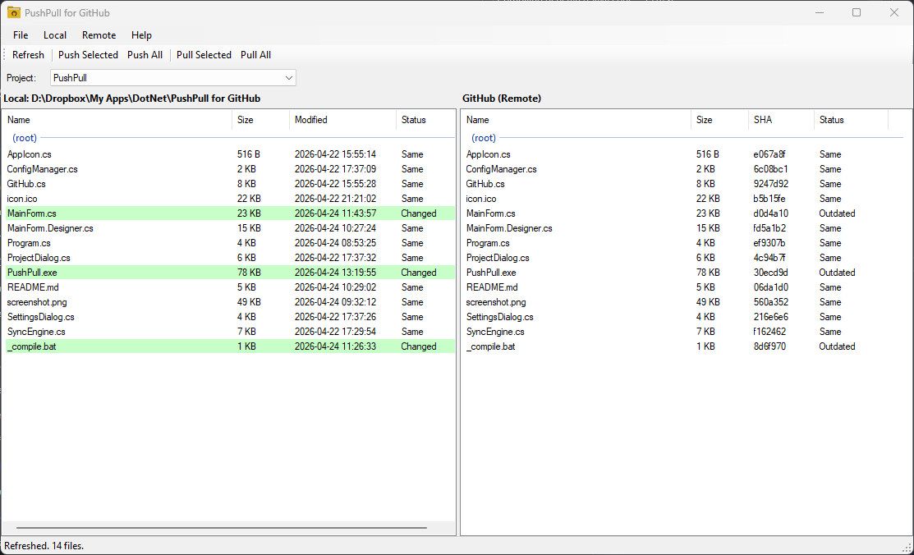

# GFD - GitHub for Dummies

A simple Windows desktop app for syncing a local folder with a GitHub repository, without needing Git installed.



## Features

- Connect to GitHub using a personal access token (no Git required)
- Register multiple projects, each linking a local folder to a GitHub repo
- Side-by-side file browser showing local and remote files (inspired by WinSCP)
- Colour-coded status: see at a glance which files are newer locally, newer on GitHub, or only exist on one side
- Push individual files or all changed files to GitHub
- Pull individual files or all changed files from GitHub
- Click column headers to sort by name or date
- Restores your last project and refreshes automatically on startup

## Requirements

- Windows
- .NET Framework 4.0 or later (included with Windows 7 and above)
- A GitHub personal access token with `repo` scope

## Installation

No installer. Just download `GFD.exe` and `icon.ico` to the same folder and run it.

## Getting Started

### 1. Create a GitHub token

1. Go to GitHub > Settings > Developer settings > Personal access tokens > Tokens (classic)
2. Click **Generate new token**
3. Give it a name (e.g. `GFD`) and select the `repo` scope
4. Copy the token

### 2. Enter your token

Open GFD, go to **Tools > Settings**, paste your token and click **Test Connection** to verify it works.

### 3. Add a project

Go to **File > New Project** and fill in:

| Field | Description |
|---|---|
| Name | A friendly label for this project |
| Local Folder | The folder on your PC to sync |
| Owner | Your GitHub username or organisation |
| Repo | The repository name |
| Branch | The branch to sync against (e.g. `main`) |
| Ignore | Files/folders to skip (one per line) |

Click **Load Branches** to populate the branch list from GitHub, or just type the branch name manually.

### 4. Refresh and sync

Click **Refresh** to compare your local folder with the remote repo. Files are colour-coded:

| Colour | Meaning |
|---|---|
| Green | File exists locally but not on GitHub, or local copy has changed |
| Blue | File exists on GitHub but not locally, or remote copy has changed |
| White | Files are identical |

Use the toolbar buttons to sync:

| Button | Action |
|---|---|
| **Refresh** | Re-compare local and remote |
| **Push Selected** | Upload files selected in the left pane |
| **Pull Selected** | Download files selected in the right pane |
| **Push All** | Upload all local-only and locally-changed files |
| **Pull All** | Download all remote-only and remotely-changed files |

## Ignore Patterns

In the project settings, you can list patterns to exclude from the comparison. One entry per line. Examples:

```
*.exe
*.dll
bin/
obj/
.vs/
```

## Config File

Settings and project definitions are stored at:

```
%APPDATA%\GFD\config.json
```

## Building from Source

Requires the .NET Framework 4 C# compiler (`csc.exe`), which ships with Windows.

Run `_compile.bat` to build `GFD.exe`.

## License

MIT
